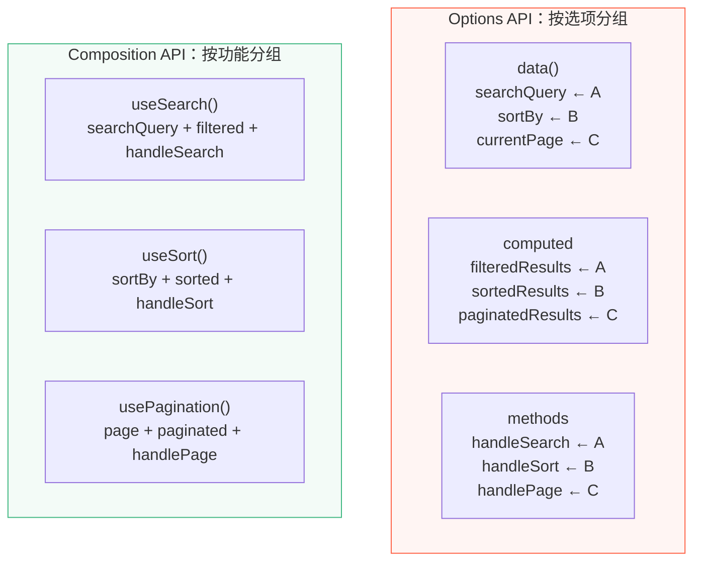
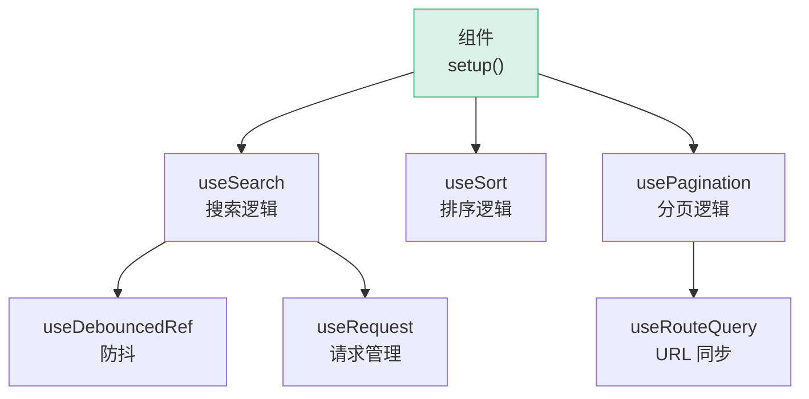

# L37 · Composition API 设计哲学

```
🎯 本节目标：理解 Composition API 的设计动机、核心理念和最佳实践
📦 本节产出：对 Vue 3 设计决策的深层理解 + Options vs Composition 对比
🔗 前置钩子：L36 的组件渲染流程（理解 setup 的执行时机）
🔗 后续钩子：L38 将讲 Vapor Mode——Vue 的下一步进化
```

---

## 1. Options API 的痛点

### 1.1 代码按选项组织 vs 按功能组织

```vue
<!-- Options API：按选项类型分组 -->
<script>
export default {
  data() {
    return {
      // 功能 A 的状态
      searchQuery: '',
      searchResults: [],
      // 功能 B 的状态
      sortBy: 'name',
      sortOrder: 'asc',
      // 功能 C 的状态
      currentPage: 1,
      pageSize: 20,
    }
  },
  computed: {
    // 功能 A 的计算属性
    filteredResults() { /* ... */ },
    // 功能 B 的计算属性
    sortedResults() { /* ... */ },
    // 功能 C 的计算属性
    paginatedResults() { /* ... */ },
  },
  methods: {
    // 功能 A 的方法
    handleSearch() { /* ... */ },
    // 功能 B 的方法
    handleSort() { /* ... */ },
    // 功能 C 的方法
    handlePageChange() { /* ... */ },
  },
  watch: {
    // 功能 A 的副作用
    searchQuery() { /* ... */ },
    // 功能 C 的副作用
    currentPage() { /* ... */ },
  },
}
</script>
```

**问题：** 相关功能的代码被**打散**到 data/computed/methods/watch 四个地方。组件变大后，理解一个功能需要在代码中反复跳转。



### 1.2 逻辑复用困难

Options API 的复用方案只有 Mixins：

```javascript
// ❌ Mixin 的问题
const searchMixin = {
  data() { return { searchQuery: '' } },
  methods: { handleSearch() { /* ... */ } },
}

const sortMixin = {
  data() { return { sortBy: 'name' } },  // 如果和另一个 mixin 同名 → 冲突！
  methods: { handleSort() { /* ... */ } },
}

export default {
  mixins: [searchMixin, sortMixin],
  // 问题 1: 命名冲突 → 谁覆盖谁？
  // 问题 2: 来源不明 → this.searchQuery 来自哪个 mixin？
  // 问题 3: 隐式依赖 → mixin 可能依赖组件的 data
}
```

| 问题 | Mixins | Composables |
|------|--------|------------|
| 命名冲突 | ❌ data/methods 可能同名 | ✅ 函数返回值，调用者命名 |
| 来源不明 | ❌ `this.xxx` 不知道来自哪里 | ✅ `const { xxx } = useXxx()` |
| 隐式依赖 | ❌ mixin 可能依赖宿主组件 | ✅ 参数显式传入 |
| TypeScript | ❌ 类型推断极差 | ✅ 完美推断 |

---

## 2. Composition API 的解法

### 2.1 按功能内聚

```vue
<script setup>
import { useSearch } from '@/composables/useSearch'
import { useSort } from '@/composables/useSort'
import { usePagination } from '@/composables/usePagination'

// 功能 A: 搜索 — 一目了然
const { searchQuery, filteredResults, handleSearch } = useSearch(rawData)

// 功能 B: 排序
const { sortBy, sortOrder, sortedResults } = useSort(filteredResults)

// 功能 C: 分页
const { currentPage, paginatedResults, handlePageChange } = usePagination(sortedResults)
</script>
```

### 2.2 Composable 的组合能力

Composable 可以互相组合，而不会冲突：

```typescript
// useSearch 内部可以使用其他 composable
function useSearch(data: Ref<any[]>) {
  const query = ref('')
  const debouncedQuery = useDebouncedRef(query, 300)  // 组合另一个 composable
  const { loading, execute } = useRequest(/* ... */)   // 组合请求

  const results = computed(() =>
    data.value.filter(item => item.name.includes(debouncedQuery.value))
  )

  return { query, results, loading }
}
```



---

## 3. 为什么不用 React Hooks

Vue 的 Composition API 和 React Hooks 看起来很像，但底层完全不同：

| | Vue Composition API | React Hooks |
|-|--------|------------|
| **执行次数** | setup 只执行 **1 次** | 每次渲染都**重新执行** |
| **依赖追踪** | 自动（Proxy） | 手动（deps 数组） |
| **闭包陷阱** | 不存在 | [重大问题](https://overreacted.io/a-complete-guide-to-useeffect/) |
| **条件调用** | ✅ composable 可以在 if/for 中调用* | ❌ 不可以 |
| **心智模型** | 响应式变量 | 快照 |

> \* 注意：`onMounted` 等生命周期钩子仍须在 setup 同步执行期间调用，不可放在 `setTimeout` 或 `await` 之后。

```javascript
// ─── Vue：setup 只执行一次 ───
setup() {
  const count = ref(0)         // 只创建一次
  const double = computed(() => count.value * 2)  // 只创建一次

  function increment() {
    count.value++                // 直接修改，Proxy 自动追踪
  }

  return { count, double, increment }
}

// ─── React：每次渲染重新执行 ───
function App() {
  const [count, setCount] = useState(0)         // 每次渲染都调用
  const double = useMemo(() => count * 2, [count])  // 需要手动声明依赖

  function increment() {
    setCount(c => c + 1)                          // 需要用函数形式避免闭包陷阱
  }

  return <div>{count}</div>
}
```

### Vue 避免闭包陷阱

```typescript
// React 的闭包陷阱
function Timer() {
  const [count, setCount] = useState(0)

  useEffect(() => {
    const id = setInterval(() => {
      console.log(count)  // ❌ 永远是 0（闭包捕获了初始值）
    }, 1000)
    return () => clearInterval(id)
  }, [])  // 空依赖 → 永远不会更新闭包
}

// Vue 没有这个问题
setup() {
  const count = ref(0)

  onMounted(() => {
    setInterval(() => {
      console.log(count.value)  // ✅ 永远是最新值（.value 是 getter）
    }, 1000)
  })
}
```

---

## 4. Composable 设计原则

### 4.1 输入响应式，输出响应式

```typescript
// ✅ 好的设计：接受 Ref 或 getter，返回 Ref
function useTitle(title: MaybeRefOrGetter<string>) {
  watchEffect(() => {
    document.title = toValue(title)
  })
}

// 使用：
useTitle('固定标题')                    // 纯字符串
useTitle(titleRef)                     // Ref
useTitle(() => `${route.meta.title}`)  // getter
```

### 4.2 约定 `use` 前缀

```typescript
// ✅ 一眼认出是 composable
useSearch()
useLocalStorage()
useDarkMode()

// ❌ 不清楚是 composable 还是普通函数
search()
getLocalStorage()
```

### 4.3 始终返回对象（不是数组）

```typescript
// ✅ 返回对象：调用者可以按需解构、重命名
function useCounter() {
  const count = ref(0)
  const increment = () => count.value++
  return { count, increment }
}

const { count, increment } = useCounter()
const { count: count2, increment: inc2 } = useCounter()  // 重命名避免冲突

// ❌ 返回数组：React 风格，不适合 Vue
// 两个以上值时可读性差
const [count, setCount] = useCounter()
```

### 4.4 副作用自动清理

```typescript
function useEventListener(target: EventTarget, event: string, handler: Function) {
  onMounted(() => {
    target.addEventListener(event, handler)
  })

  // ✅ 组件卸载时自动清理
  onUnmounted(() => {
    target.removeEventListener(event, handler)
  })
}
```

---

## 5. 何时用 Options API

Composition API 不是要"替代"Options API，而是在复杂场景下提供更好的选择：

| 场景 | 推荐 |
|------|------|
| 简单组件（< 100 行） | Options 或 Composition 都行 |
| 复杂组件（> 200 行） | ✅ Composition API |
| 需要复用逻辑 | ✅ Composable |
| 团队新手多 | Options 学习曲线更平缓 |
| TypeScript 项目 | ✅ Composition API（类型推断好） |
| 需要跨组件共享逻辑 | ✅ Composable + Pinia |

---

## 6. 本节总结

### 检查清单

- [ ] 能解释 Options API 的三个痛点（代码分散、复用困难、TS 支持差）
- [ ] 理解 Composition API 如何按功能内聚代码
- [ ] 理解 Composable 的组合能力 vs Mixin 的缺陷
- [ ] 能对比 Vue Composition API 和 React Hooks 的核心差异
- [ ] 知道 Vue 为什么没有闭包陷阱（setup 只执行一次）
- [ ] 掌握 Composable 设计四原则（响应式IO、use前缀、返回对象、自动清理）
- [ ] 知道何时 Options API 仍然合适

### 🐞 防坑指南

| 坑 | 说明 | 正确做法 |
|----|------|---------|
| composable 中用 `this` | Composition API 没有 `this` | 用 ref/reactive 管理状态 |
| composable 不清理副作用 | `setInterval`/`addEventListener` 泄漏 | 在 `onUnmounted` 中清理 |
| composable 返回数组 | `[count, setCount]` 多值时可读性差 | 返回对象 `{ count, setCount }` |
| 过早抽取 composable | 功能还没稳定就抽取 → 频繁改接口 | 先在组件内写清楚，稳定后再抽取 |

### 📐 最佳实践

1. **输入灵活**：用 `MaybeRefOrGetter<T>` 接受 ref、getter 或纯值
2. **命名一致**：composable 用 `use` 前缀，内部 ref 不再加 `Ref` 后缀
3. **单一职责**：一个 composable 只处理一个关注点（搜索/排序/分页分开）
4. **可测试性**：composable 是纯函数 + 响应式 → 可以不依赖组件独立测试

### Git 提交

```bash
git add .
git commit -m "L37: Composition API 设计哲学 + Composable 设计原则"
```


### 🔬 深度专题

> 📖 [D01 · Options API vs Composition API](/lessons/deep-dives/D01-options-vs-composition) — 两种范式的设计哲学对比
> 📖 [D09 · Composables vs React Hooks](/lessons/deep-dives/D09-composables-vs-hooks) — 同样是"钩子"，心智模型为何不同？
> 📖 [D12 · 闭包陷阱](/lessons/deep-dives/D12-closure-traps) — setTimeout 里为什么拿到旧值？

### 🔗 → 下一节

L38 将讲 Vapor Mode——Vue 团队正在开发的新编译策略，彻底去掉 Virtual DOM，直接编译为原生 DOM 操作。
