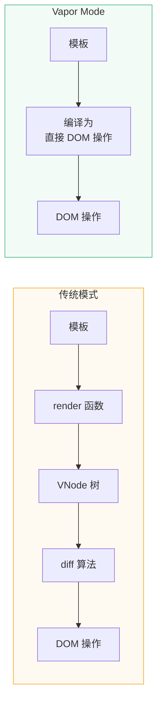
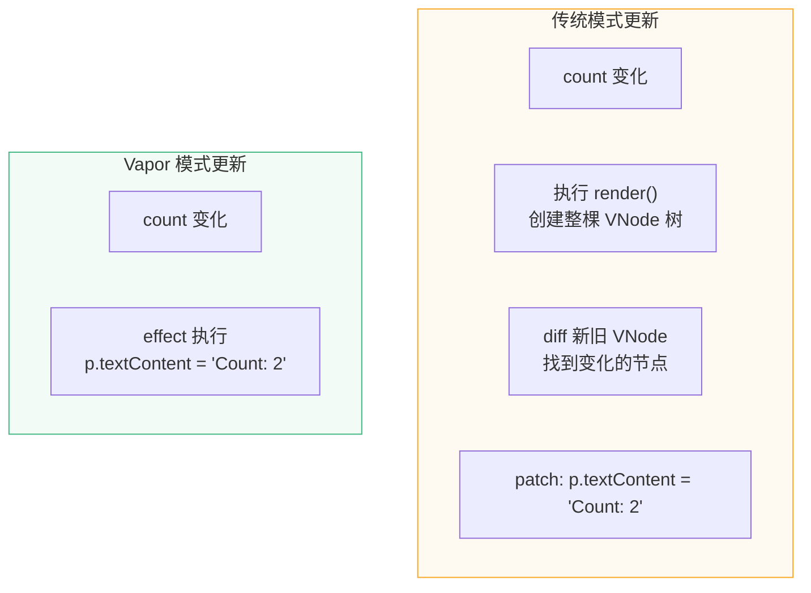
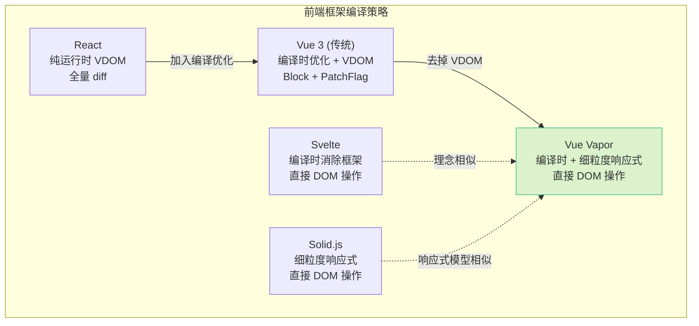
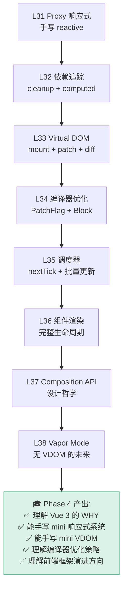

# L38 · Vapor Mode：无虚拟 DOM 的未来

```
🎯 本节目标：理解 Vue Vapor Mode 的设计目标、编译策略与性能优势
📦 本节产出：理解 Vapor 编译输出 + 与传统 VDOM 的对比 + Vue 技术路线展望
🔗 前置钩子：L33-L34 的 Virtual DOM + 编译器优化
🔗 后续钩子：Phase 4 完结，回顾全课程知识体系
```

---

## 1. 什么是 Vapor Mode

**Vapor Mode 是 Vue 的一种全新编译策略，将模板直接编译为原生 DOM 操作，完全绕过 Virtual DOM。**



**核心思想：** 既然编译器已经知道模板的全部结构（哪些是静态的、哪些是动态的），为什么还要在运行时创建 VNode、diff 再操作 DOM？直接编译成精确的 DOM 操作不就行了？

---

## 2. 编译输出对比

### 传统 VDOM 模式

```vue
<template>
  <div class="counter">
    <h1>{{ title }}</h1>
    <p>Count: {{ count }}</p>
    <button @click="count++">+1</button>
  </div>
</template>
```

编译为（传统模式）：

```javascript
// 每次更新都执行：创建 VNode → diff → patch
function render() {
  return h('div', { class: 'counter' }, [
    h('h1', null, title.value),               // 创建 VNode 对象
    h('p', null, 'Count: ' + count.value),    // 创建 VNode 对象
    h('button', { onClick: () => count.value++ }, '+1'),
  ])
}
```

### Vapor Mode

编译为（Vapor 模式）：

```javascript
// setup 阶段：创建 DOM + 绑定响应式
function setup() {
  // 1. 创建 DOM 结构（只执行一次）
  const div = document.createElement('div')
  div.className = 'counter'

  const h1 = document.createElement('h1')
  const p = document.createElement('p')
  const button = document.createElement('button')
  button.textContent = '+1'
  button.addEventListener('click', () => count.value++)

  div.append(h1, p, button)

  // 2. 绑定响应式更新（精确到单个 DOM 操作）
  effect(() => {
    h1.textContent = title.value      // 直接操作 DOM
  })

  effect(() => {
    p.textContent = 'Count: ' + count.value  // 直接操作 DOM
  })

  return div
}
```



**关键区别：** Vapor 模式下，每个动态绑定都有自己独立的 `effect`，数据变化时直接操作对应的 DOM 节点，不需要创建 VNode、不需要 diff。

---

## 3. 性能对比

### 3.1 运行时开销

| 开销 | 传统 VDOM | Vapor Mode |
|------|----------|-----------|
| VNode 创建 | 每次更新创建新 VNode 对象 | 无 VNode |
| diff 计算 | 遍历 dynamicChildren | 无 diff |
| 内存占用 | 存储新旧两棵 VNode 树 | 只有 DOM 引用 |
| GC 压力 | 旧 VNode 需要回收 | 极低 |
| 首次渲染 | 创建 VNode + patch | 直接创建 DOM |
| 更新粒度 | 以组件为单位 | 以绑定为单位 |

### 3.2 包体积

```
传统模式运行时（runtime-core + runtime-dom）  ≈ 50KB gzip
Vapor 模式运行时                                ≈ 6KB gzip（减少 ~88%）
```

因为 Vapor 不需要 VNode 创建函数、不需要 diff 算法、不需要 patch 函数，运行时大幅缩小。

### 3.3 什么时候 VDOM 更好

Vapor 不是万能的，VDOM 在某些场景有优势：

| 场景 | VDOM | Vapor |
|------|------|-------|
| 列表大量增删 | ✅ diff + LIS 最小操作 | 需要额外优化 |
| 跨平台渲染 | ✅ 自定义 renderer | 绑定到 DOM |
| render 函数 / JSX | ✅ 原生支持 | ❌ 需要模板 |
| 高度动态组件 | ✅ 灵活 | 复杂 |
| 简单静态页面 | 过度开销 | ✅ 完美匹配 |
| 频繁单点更新 | 还行 | ✅ 精确到节点 |

---

## 4. Vapor 处理条件和列表

### 4.1 v-if

```vue
<template>
  <div v-if="show">Hello</div>
  <div v-else>Bye</div>
</template>
```

Vapor 编译为：

```javascript
function setup() {
  const placeholder = document.createComment('v-if')
  let currentBlock = null

  effect(() => {
    // 根据条件创建或销毁 DOM
    if (show.value) {
      if (currentBlock) currentBlock.remove()
      const div = document.createElement('div')
      div.textContent = 'Hello'
      placeholder.parentNode.insertBefore(div, placeholder)
      currentBlock = div
    } else {
      if (currentBlock) currentBlock.remove()
      const div = document.createElement('div')
      div.textContent = 'Bye'
      placeholder.parentNode.insertBefore(div, placeholder)
      currentBlock = div
    }
  })

  return placeholder
}
```

### 4.2 v-for

```vue
<template>
  <div v-for="item in list" :key="item.id">
    {{ item.name }}
  </div>
</template>
```

Vapor 需要特殊的列表协调策略（类似 Solid.js 的 `<For>` 组件），按 key 跟踪每个条目的 DOM 元素，在列表变化时最小化 DOM 操作。

---

## 5. 与其他框架的对比



| 框架 | VDOM | 编译优化 | 响应式粒度 | 包体积 |
|------|------|---------|-----------|-------|
| React | ✅ 全量 diff | Compiler (实验) | 组件级 | ~40KB |
| Vue 3 传统 | ✅ + PatchFlag | ✅ Block Tree | 组件级 | ~33KB |
| Svelte | ❌ | ✅ 消除框架 | 赋值级 | ~2KB |
| Solid.js | ❌ | ✅ | 信号级 | ~7KB |
| **Vue Vapor** | ❌ | ✅ | 信号级 | ~6KB |

---

## 6. 当前状态与使用方式

> **版本信息**
> - 适用版本：Vue 3.6+
> - 当前状态：Feature-complete in 3.6 beta, 仍标记为 **unstable**
> - 最后核对：2026-04-01
> - 参考来源：[Vue 3.6.0-beta.1 Release](https://github.com/vuejs/core/releases/tag/v3.6.0-beta.1)

**截至 2026-04-01 的状态：**

- Vapor Mode 已在 Vue 3.6 beta 中达到 feature-complete，但仍标记为 **unstable**
- 原 `vuejs/vue-vapor` 仓库已于 2025-07-19 归档，开发已转移到 `vuejs/core` 的 vapor branch
- API 和编译输出仍可能变化，不建议在生产环境使用

设计目标是：

1. **渐进式采用**：可以在同一个项目中混用 Vapor 和传统组件
2. **相同的 API**：仍然用 `ref()`、`computed()`、`watch()`，开发者代码不变
3. **逐组件启用**：通过 `<script setup vapor>` 标记单个组件使用 Vapor 编译

```vue
<script setup vapor>
// 这个组件使用 Vapor Mode 编译
const count = ref(0)
</script>
```

---

## 7. Phase 4 总结



### 知识链路

```
用户代码 → Proxy 拦截 → track 收集依赖 → 数据变化 → trigger 通知
→ scheduler 排队 → 微任务执行 → render 生成 VNode
→ diff 找到变化 → patch 操作 DOM → 浏览器渲染 → 用户看到更新

Vapor 简化为：
用户代码 → Proxy 拦截 → 数据变化 → 直接操作 DOM → 浏览器渲染
```

### Git 提交

```bash
git add .
git commit -m "L38: Vapor Mode + Phase 4 完成 [全课程完结]"
git tag phase-4-complete
```
